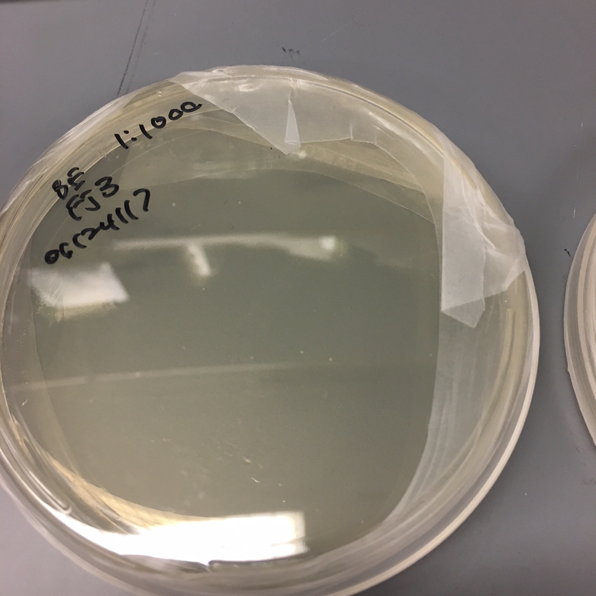

# Autogenerated details for `FJ3`

## Sample information:

+ sample_id: FJ3
+ fraternity: Theta Delta Chi
+ date: 2017-06-11
+ time: 2:19
+ location: basement

## FJ3-sample-site-01

+ EXIF DateTimeOriginal: 2017:06:11 02:19:09
+ Geolocation: (43.70265555555556, -72.29152777777777)

## FJ3-sample-site-02

+ EXIF DateTimeOriginal: 2017:06:11 02:19:14
+ Geolocation: (43.70265555555556, -72.29152777777777)

## FJ3-sample-site-03

+ EXIF DateTimeOriginal: 2017:06:11 02:19:16
+ Geolocation: (43.70265555555556, -72.29152777777777)

## FJ3-sample-site-04

+ EXIF DateTimeOriginal: 2017:06:11 02:19:19
+ Geolocation: (43.70265833333334, -72.29153333333333)

## FJ3-sample-site-05

+ EXIF DateTimeOriginal: 2017:06:11 02:19:22
+ Geolocation: (43.70265833333334, -72.29153333333333)

## FJ3-plated-10-and-1000

+ EXIF DateTimeOriginal: 2017:06:25 11:49:05
+ Geolocation: None

## FJ3-plated-10

+ EXIF DateTimeOriginal: 2017:06:25 12:01:13
+ Geolocation: None

## FJ3-plated-1000

+ EXIF DateTimeOriginal: 2017:06:25 12:01:17
+ Geolocation: None

